# Linear Feedback Shift Register

<table>
  <tr>
    <td>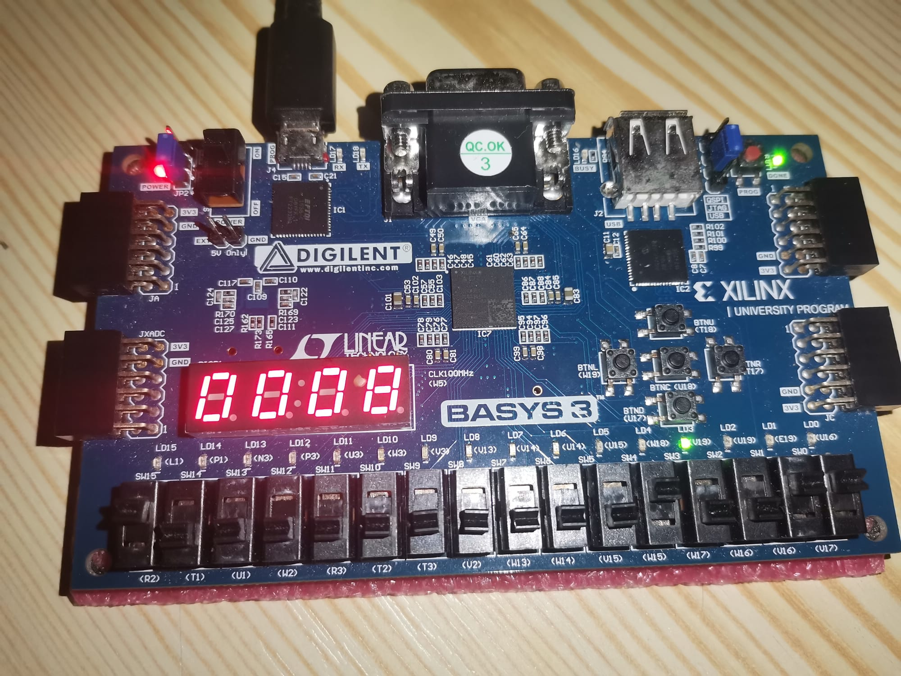</td>
    <td>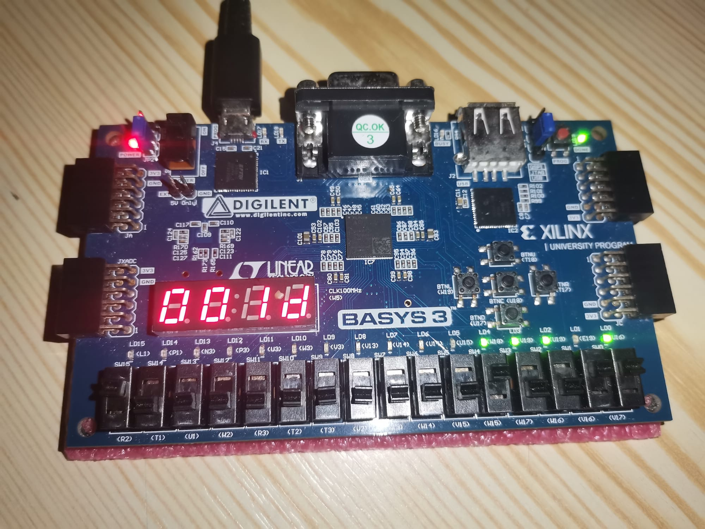</td>
  </tr>
  <tr>
    <td>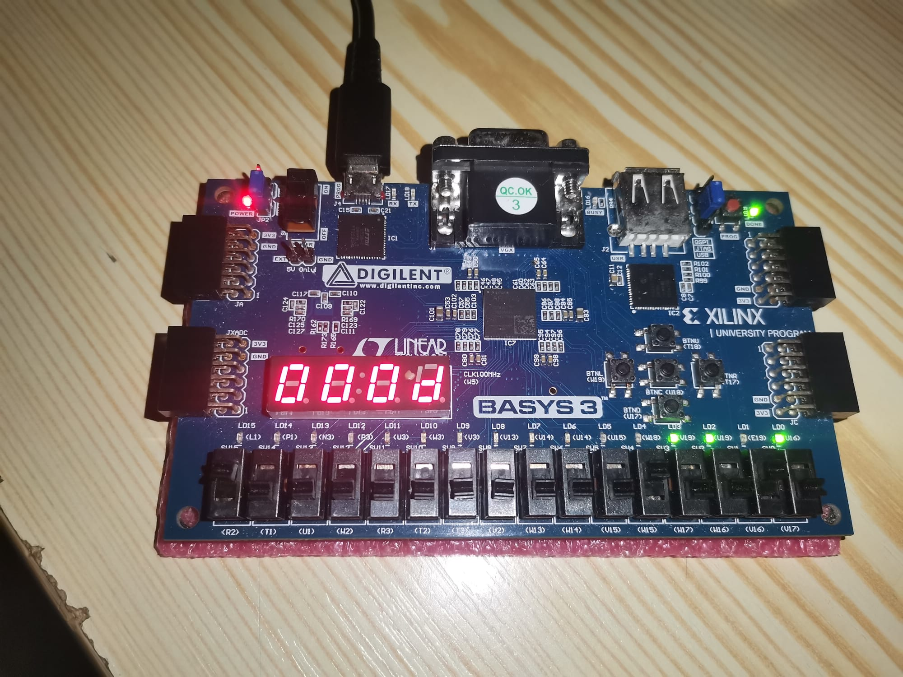</td>
    <td>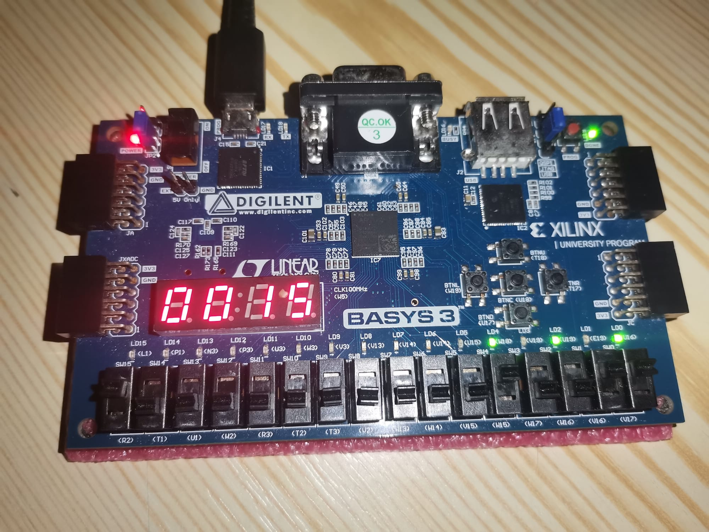</td>
  </tr>
</table>


## Table of Contents:

1. [Project Specification](#project-specification)
2. [Black Box](#black-box)
3. [Detailed Schematic](#detailed-schematic)
4. [Control and Extend Signal Assignments](#control-and-extend-signal-assignments)
5. [VHDL Code](#vhdl-code)
6. [7-Segment Implementation](#7-segment-implementation)
7. [Simulated Behavior Results](#simulated-behavior-results)
8. [User Manual](#user-manual)
9. [Future Developments](#future-developments)

## 1. Project Specification:

Implement linear feedback counters (LFSR). The designed system receives as inputs the length of the counting loop and the selection of the 4-bit or 5-bit variant.

## 2. Black Box:

The device has 8 inputs: One for the Clock, one for Reset function, one for the selection of the 4-bit or 5-bit variant, and a 5-bit bus representing the counting loop’s length minus one encoded in binary. For example, if we wanted to count in a 23 long loop, then we would set variant to ‘1’ for 5-bits (since 23 is greater than 16), looplen to 22 (23 minus 1) encoded in binary = “10110”, Rst to ‘1’ (to disable it, as the circuit initially starts in the reset state) and start pressing the clock button to see the loop begin. Similarly, for a 16 long loop in 4 bits, variant = ‘0’, looplen = “01111”, 16 long loop in 5 bits would make variant = ‘1’ etc. The device has 5 outputs: A 5-bit bus representing the current number of the LFSR encoded in the binary numbering system.

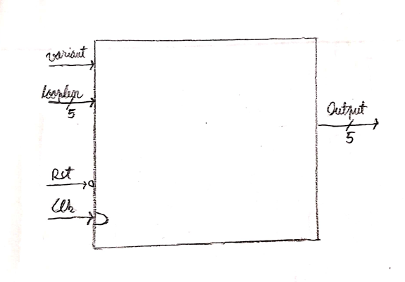

## 3. Detailed Schematic:

The circuit below is an inside view of the black box previously presented. It represents a shift register with additional logic to allow the 4-bit and 5-bit cases, as well as the XNOR logic not only for both cases but for dynamic loop length of LFSR counter:

According to the documentation, XNOR has to be between the last 2 bits in 4-bit case and between bit 3 and 5 in the 5-bit case; this is achieved by using boolean logic with the “variant” signal and “Currstate” as seen in the schematic. The clock was achieved by using the Nexys4 100MHz clock, dividing it to the extent where it is ~1Hz, with a frequency divider on 26 bits.

*Control and sometimes Extend are prone to changes depending on looplen; the whole schematic would imply a 5-bit DMUX and another 4-bit DMUX, both tied to the outputs of another 1-bit MUX representing the IF and CASE statements in the VHDL code below. Since this would unnecessarily complicate the schematic, they were omitted. The behavior of Control and Extend are explained both in commented code and also in the chapter below.

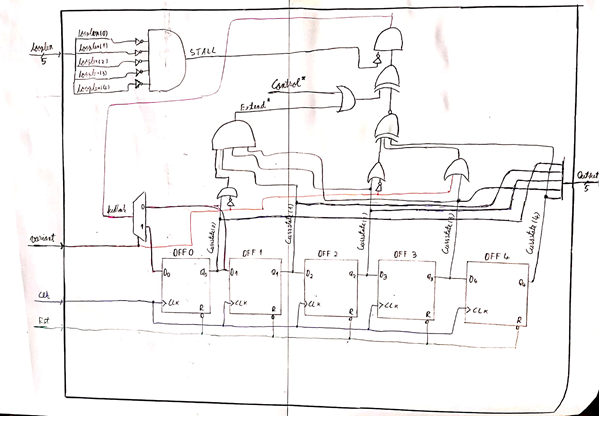

## 4. Control and Extend Signal Assignments:

The “Control” signal is the equivalent of gate ‘C’ from the book; The “Extend” signal is for gate ‘B’. The last rightmost bit of “Extend” needs to be included in the AND gate only in particular cases, which is why “Extend” originally only includes the first n-1 bits. “Control” signal is assigned according to the table of values present in the documentation.

According to the two tables, 4 and 5 bits respectively, “Control” gate ‘C’ must be assigned in such a way that the specific state of the counter is detected for each desired loop length. This is done in each case with the help of an AND gate and inverters between “Currstate” signals as seen in the tables; ‘0’ would require the signal to be inverted and ‘1’ just to pass it as it is. Here is an example for detecting the “10001” state for a loop length of 9 of the 5-bit variant:

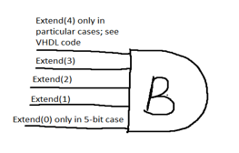
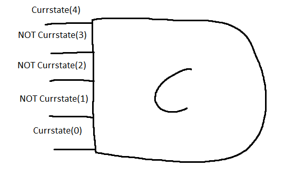

## 5. VHDL Code:

The entity is just the black box expressed in VHDL code. Low variant will indicate 4-bit operation mode and high variant will indicate 5-bit operation mode.

This is the part of the architecture where all the internal signals are initialized with their corresponding logic, the Clk and Rst functions are implemented as well as the shifting of the register according to 4-bit or 5-bit situations. Additional details are written with green color in the commented code. Then, the most important signal, Control, is being assigned according to the corresponding loop length and variant; The logic is taken from the table discussed above in chapter 4.

### 4-BIT case:

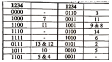

### 5-BIT case:

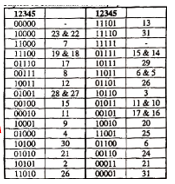

The constraints applied on both the Nexys4 and Nexys3 boards is present in the repository code as .xdc and .txt files named appropriately.

## 6. 7-Segment Implementation:

Although not asked in the problem, having a good way of understanding the outputs is very helpful, especially for people outside of computer science who don’t understand binary code, which is why I decided to also implement a 7-Segment display for the binary values. The first step is to have a frequency divider; a counter on 16 bits in this case, with the end goal of achieving ~250Hz frequency of LEDs on the FPGA board, because there are only 7 cathodes but 8 anodes, meaning that every 7-Segment has to turn on sequentially to ‘fool’ our eyes to think that they are individually turned on. Then, we have a MUX with the binary input for each segment, which will be decoded to tell which segment to turn on to represent different characters. The concept is illustrated in the following images:

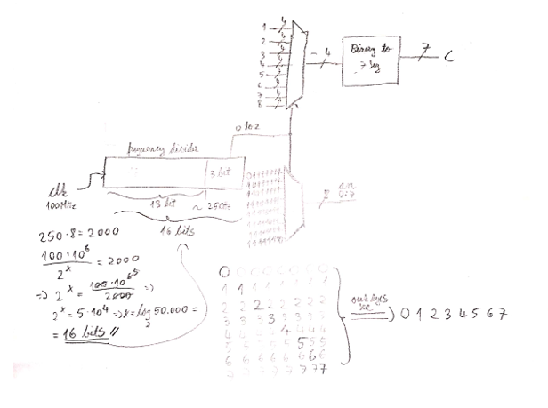

## 7. Simulated Behavior Results:

Below is a list of all the possible circuit counting loops, starting with variant = ‘1’ and looplen from “11111” all the way down to “00000”, then variant = ‘0’ and looplen from “01111” down to “00000”, essentially running all loop lengths from 32 down to 0 for the 5-bit variant and then again from 16 down to 0 for the 4-bit variant:

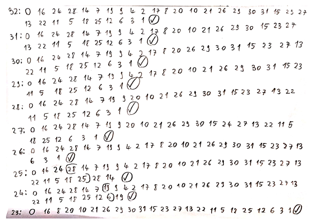

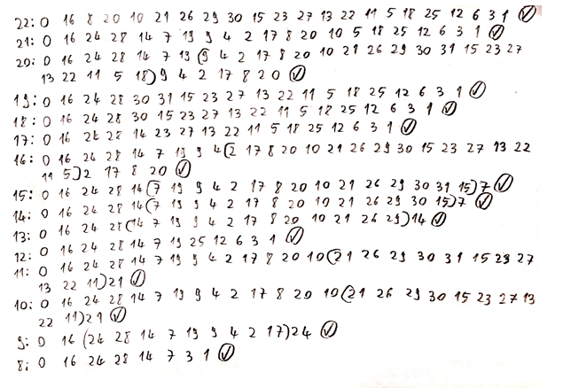

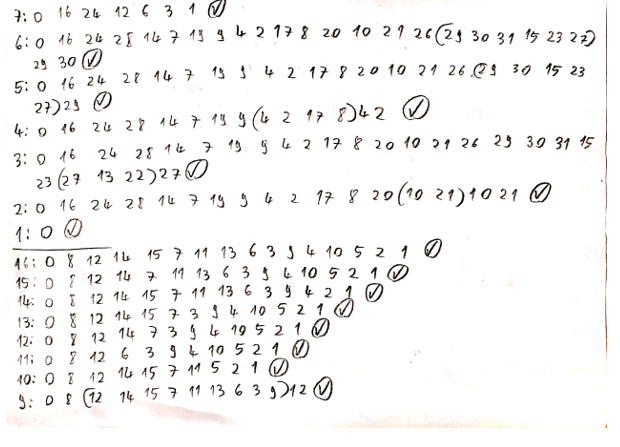

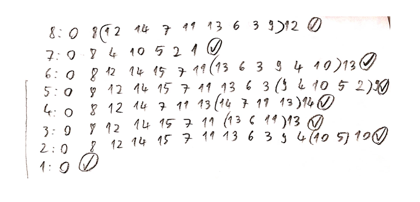

Notes: Circled checkmark symbols at the end of each loop were used to mark correct behavior; Parentheses were sometimes used in cases of loops not immediately entered from the “00000” state to indicate repeating loop; Leftmost number before the colon represents the looplen’s value converted to decimal; All values are in binary numbering system, they were converted to decimal for ease of readability; All tests were done starting from the reset “00000” state.

## 8. User Manual:

Since ‘Rst’ is active low, the circuit starts in the “00000” state. If ‘Clk’ occurs while ‘Rst’ is 0, nothing will happen. In order to start the circuit, the user must first put ‘variant’ to either 0 or 1, 0 representing 4-bits and 1 representing 5-bits. After the desired variant is chosen, looplen must be set according to the user’s needs; note that binary values over 15(“01111”) will not work in the 4-bit mode, and the circuit will count on the maximal 16 long loop. After ‘variant’ and ‘looplen’ are set, the circuit is ready to start and ‘Rst’ can be set to 1. Each clock pulse will output pseudo-randomly generated values, taking [chosen loop length]+1 clock pulses to repeat the same value; note that some loops do not start exactly from the zero state, and will initially take additional pulses to reach their loop, as indicated in the simulated behavior chapter.

## 9. Future Developments:

This project is just a small, simple presentation of how LFSRs work. In reality, many if not all will be on more than 5 bits since they serve an important role in modern cryptography problems, and it is not desired to have repeating or easily predictable random numbers; note that they cannot be reliably used for encryption, as their outputs can always be reverse-engineered, no matter how long the bit sequence is. For a higher number of bits, the maximal loop length can be easily achieved with XNOR between bits as shown in the 4bit and 5bit tables from above.

## Cloning

To get a local copy of this project up and running on your machine, simply clone this repository using Git:

```sh
git clone https://github.com/AndreiE91/Linear_Feedback_Shift_Register.git
cd Linear_Feedback_Shift_Register
```

Open and implement the project in Vivado or any other VHDL tool afterwards.
